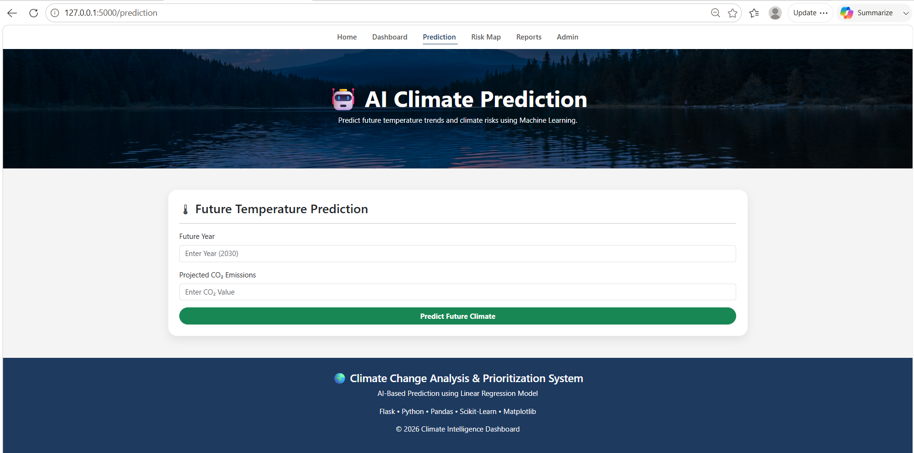
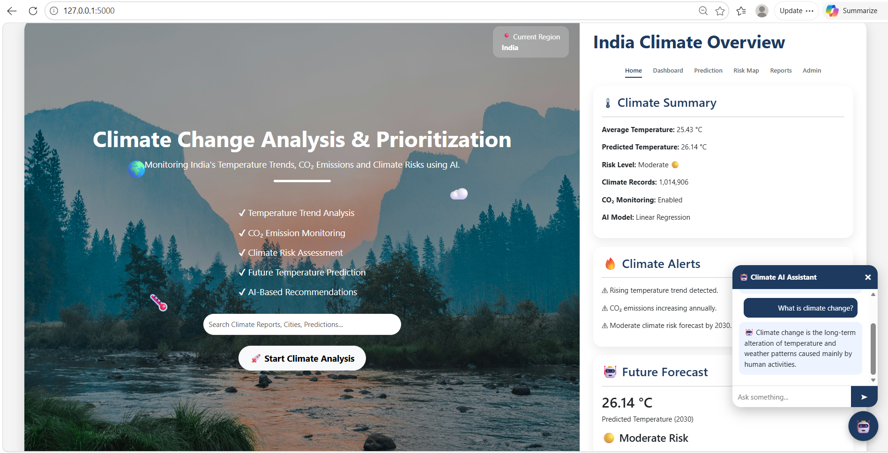
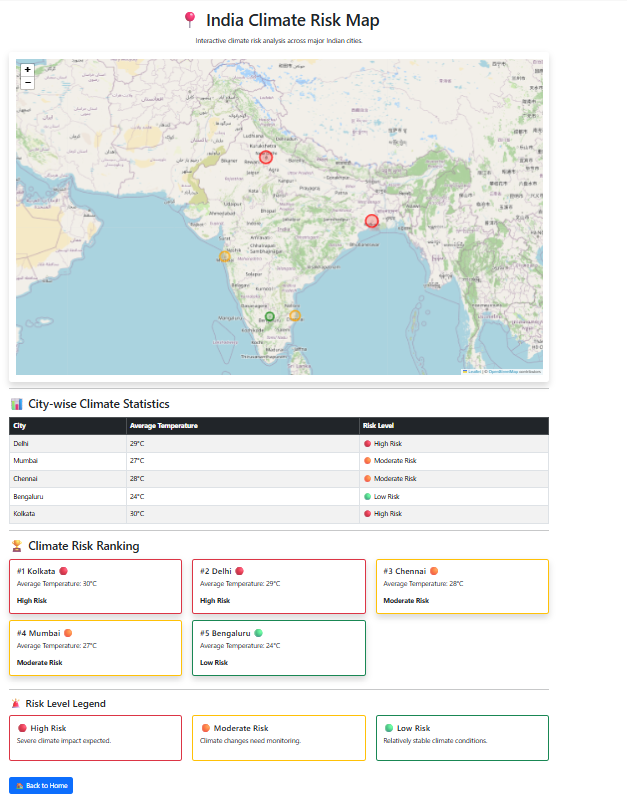

# Climate Change Analysis & Prioritization

## Project Overview
This project analyzes climate change trends in India using temperature and CO₂ emission datasets. It provides data visualization, climate risk prediction, an AI chatbot, and climate reports.

## Features
- Climate Dashboard
- Temperature Trend Analysis
- CO₂ Emission Analysis
- Climate Risk Prediction
- Interactive India Map
- Climate Chatbot
- PDF Report Generation
- Admin Panel

## Technologies Used
- Python
- Flask
- Pandas
- Scikit-Learn
- Plotly
- Folium
- HTML
- CSS
- JavaScript

## Datasets
- Global Land Temperature Dataset
- CO₂ Emission Dataset

## Installation

1. Clone repository

```bash
git clone https://github.com/SanjuvigasiniRK/Climate-change-analysis.git
```

2. Install dependencies

```bash
pip install -r requirements.txt
```

3. Run application

```bash
python app.py
```
## Screenshots

### Dashboard


### Climate Prediction


### AI Chatbot


### India Climate Map

## Author
Sanju Vigasini R K
